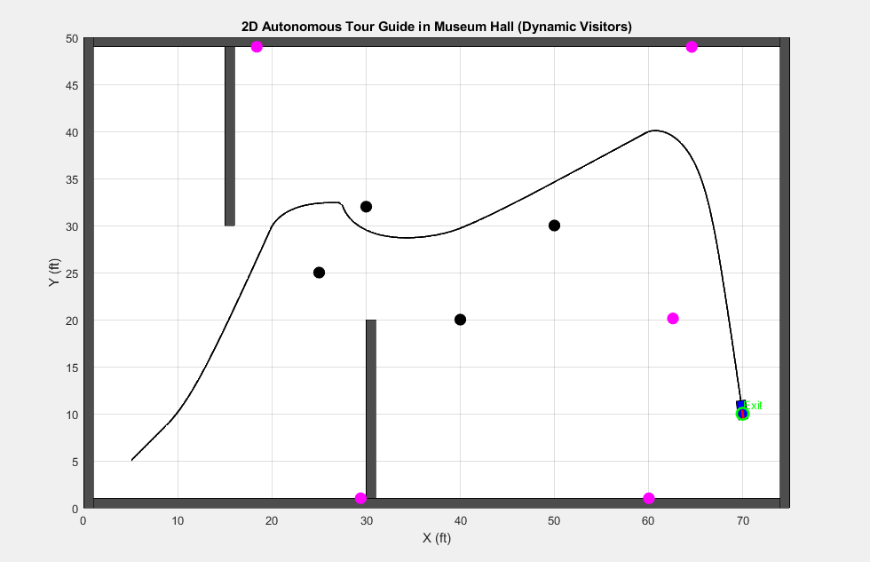
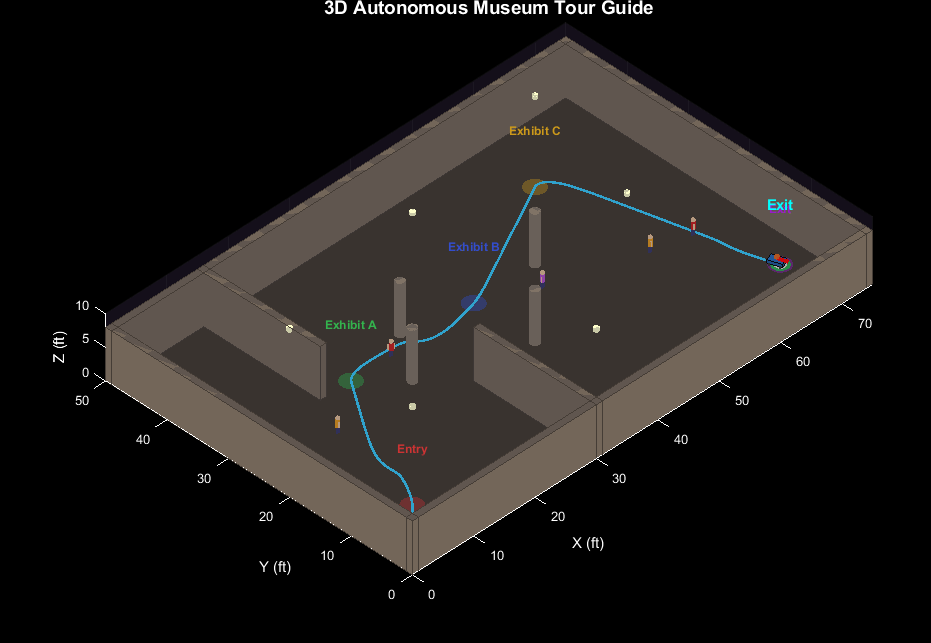

# Museum Hall Tour Guide Robot

## Overview

This project presents a MATLAB-based autonomous museum tour guide robot designed to navigate a 50 ft × 75 ft indoor museum environment containing static obstacles, dynamic visitors, and multiple exhibits. The system performs waypoint-based navigation and real-time obstacle avoidance while interacting with a semi-structured environment.

The robot architecture is based on Raspberry Pi 4 hardware specifications and incorporates simulated sensors including LiDAR, camera, IMU, proximity sensors, and motor actuators. Sensor data are processed through a complete sensor-to-actuator chain to enable autonomous decision-making and motion control. Realistic 2D and 3D simulations featuring museum layouts, walls, exhibits, humanoid visitors, and robot motion were developed to evaluate system performance.

The project also investigates reinforcement learning concepts using Q-learning for adaptive navigation and path optimization, while considering real-time operating system requirements and embedded deployment compatibility.

---

## Features

* Autonomous navigation in a 50 ft × 75 ft museum environment.
* Waypoint-based path planning.
* Real-time obstacle detection and avoidance.
* Dynamic human visitor simulation.
* LiDAR, camera, IMU, and proximity sensor modeling.
* Potential field and sensor ray-casting methods.
* Complete sensor → processing → motor control chain.
* Realistic 2D and 3D MATLAB visualization.
* Reinforcement learning using Q-learning concepts.
* RTOS and embedded deployment considerations.

---

## Environment

* Indoor semi-structured environment.
* Dynamic obstacles and visitor interactions.
* Multiple exhibits acting as waypoints.
* Safety-critical obstacle avoidance.

---

## Hardware Architecture

The system is designed according to Raspberry Pi 4 Model B specifications and includes the following simulated components:

### Sensors

* RPLIDAR A1
* Pi Camera
* MPU-6050 IMU
* HC-SR04 Ultrasonic Sensor
* VL53L0X Distance Sensor
* ReSpeaker 2-Mic Voice Interface

### Actuators

* DC Motors
* Servo Motors
* Audio Output System
* LEDs and Buzzer

---

## Navigation and Obstacle Avoidance

The robot follows predefined waypoints representing museum exhibits. Real-time obstacle avoidance is achieved using:

* LiDAR ray-casting
* Potential field methods
* Dynamic visitor detection
* Reactive collision avoidance

The robot continuously updates its motion commands based on sensor feedback and environmental conditions.

---

## Real-Time System Design

Different tasks were classified according to their real-time requirements:

| Task                | Real-Time Type |
| ------------------- | -------------- |
| Obstacle Avoidance  | Hard           |
| Emergency Stop      | Hard           |
| Navigation          | Firm           |
| Localization        | Firm           |
| Battery Monitoring  | Firm           |
| User Interaction    | Soft           |
| Environment Mapping | Soft           |
| Tour Control Flow   | Soft           |

The system framework was designed considering compatibility with MATLAB Real-Time and future embedded deployment.

---

## Reinforcement Learning

Q-learning concepts were investigated to enable adaptive navigation.

### State Variables

* Robot position
* Orientation
* Sensor readings
* Relative goal direction

### Action Space

* Move Forward
* Turn Left
* Turn Right
* Stop

### Reward Function

* Reaching exhibits
* Avoiding obstacles
* Collision penalties
* Path efficiency optimization

---

## I/O Processing Chain

Sensor inputs are processed through an autonomous controller which generates motor commands.

Sensor → Agent Controller → Velocity Commands → Motor Actuation

The complete chain was verified through simulation and logging.

---

## Simulation Results

✔ Autonomous navigation achieved.

✔ Dynamic obstacle avoidance implemented.

✔ Sensor ray-casting successfully simulated.

✔ Real-time response verified.

✔ Input-to-output processing chain validated.

✔ Realistic 2D and 3D environments developed.

✔ Adaptive navigation concepts investigated using Q-learning.

---

## Project Structure

```text
Autonomous Museum-Hall-Tour-Guide
│
├── Museum_Hall_Tour_Guide_2D.m
├── Museum_Hall_Tour_Guide_3D.m
├── images
│   ├── 2D_Autonomous_Tour_Guide_in_Museum_Hall.png
│   └── 3D_Autonomous_Tour_Guide_in_Museum_Hall.png
│
├── video
|   ├── museum_tour_guide_simulation_2D.mp4
│   └── museum_tour_guide_simulation_3D.mp4
│
├── report
│   └── Report.pdf
│
└── README.md
```

---

## Images

### 2D Simulation



### Realistic 3D Simulation



---

## Demonstration Video

https://github.com/user-attachments/assets/your-video-link

---

## Future Work

* ROS 2 integration.
* SLAM implementation.
* Deep Q-Learning.
* Voice-guided interaction.
* Embedded deployment on Raspberry Pi.
* Multi-robot coordination.

---

## Author

**Rohit**

M.Tech in Advanced Manufacturing and Design
Mechanical Engineering
